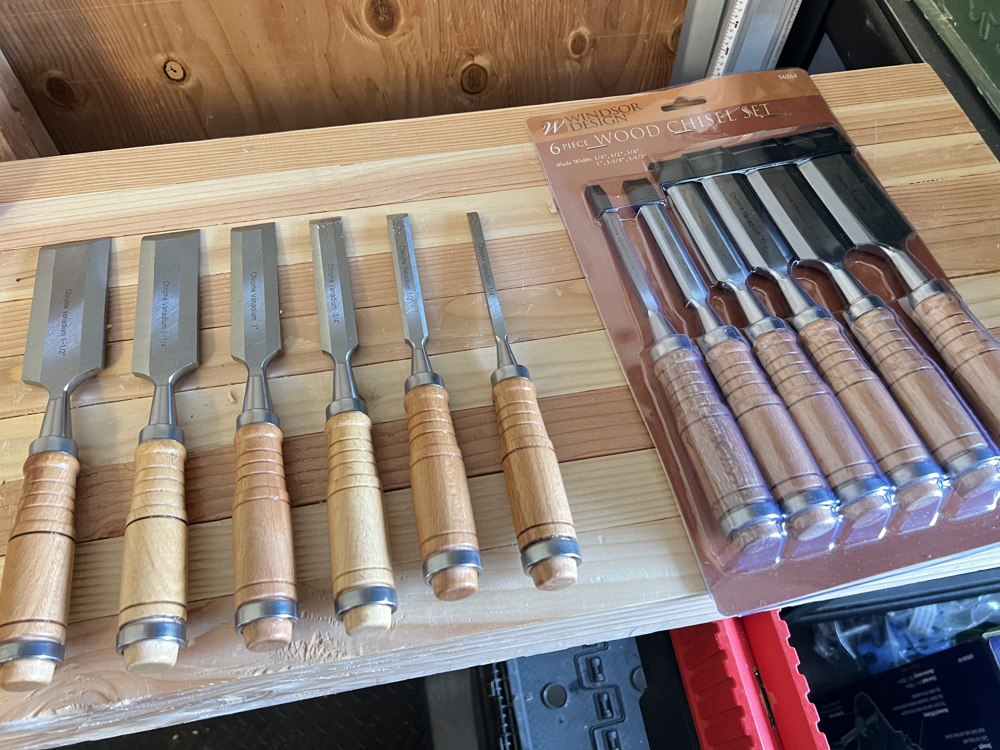
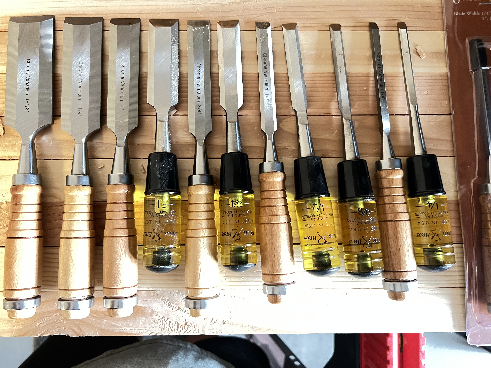
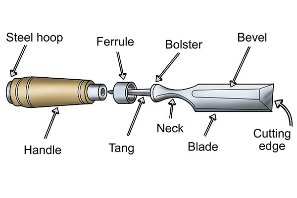
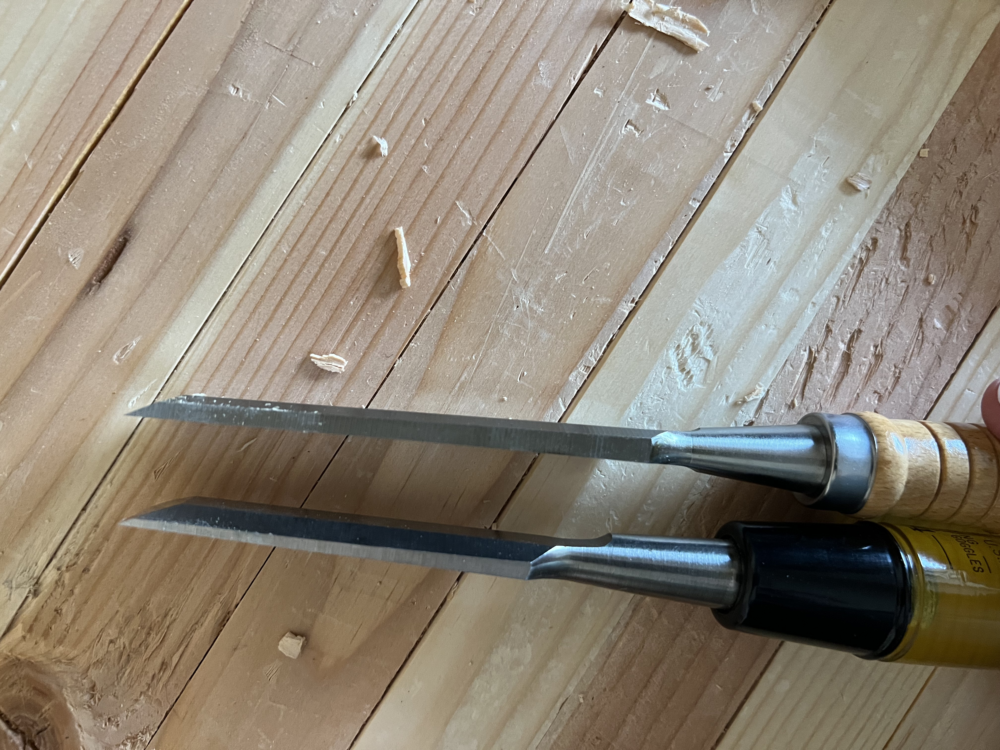
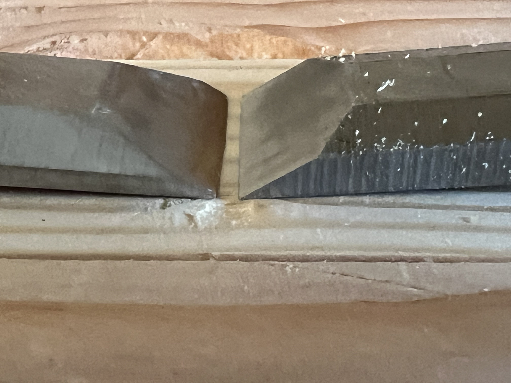
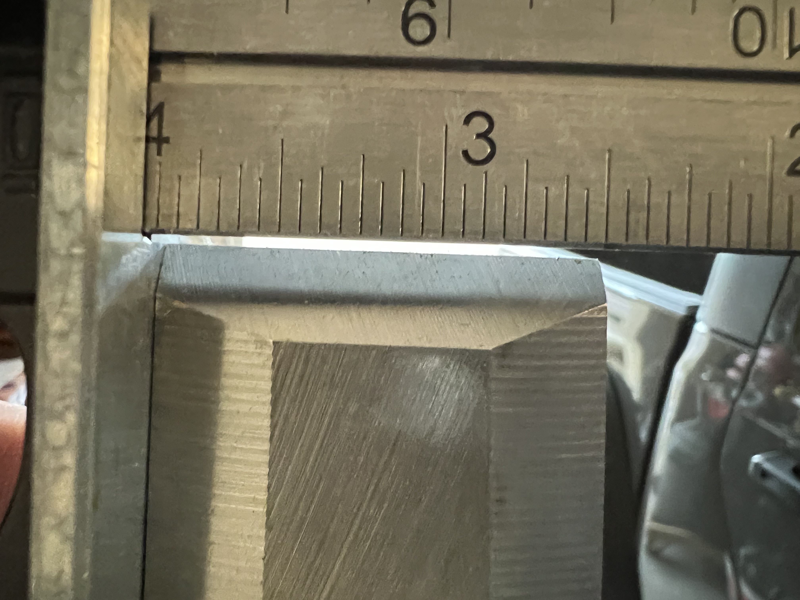
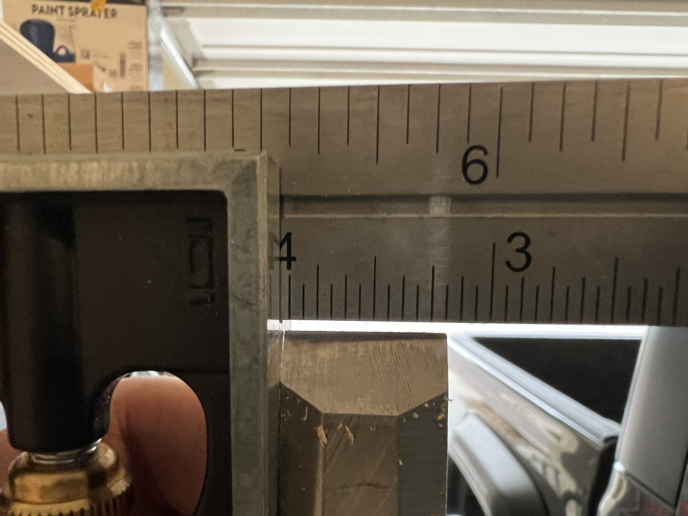
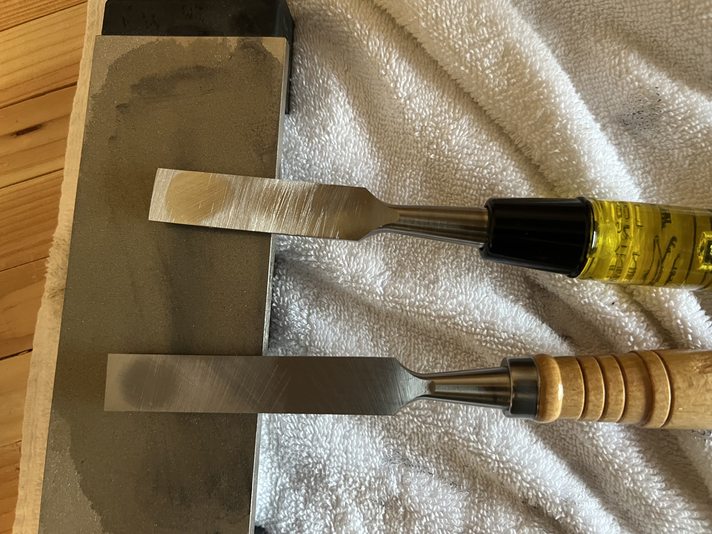
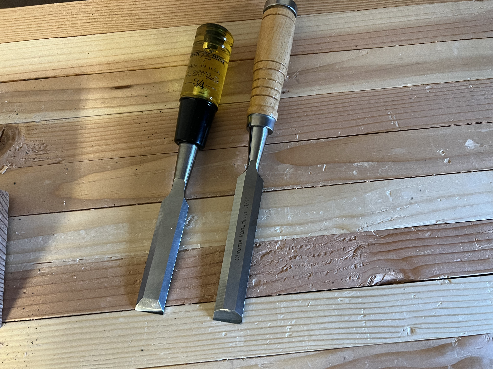

---

layout   : post
author   : bruce
toc      : false
comments : false
title    : "Harbor Freight Chisels - Windsor Design Chisels"
beforetoc: "An initial look at the Windsor Chisel set from Harbor Freight Tools"
categories: [ woodworking, tools, review ]
image     : assets/images/2023-9-1 Cheap Chisels/IMG_8004.jpeg
featured  : true

---

# Cheap Chisels - Windsor Chisel Set from Harbor Freight

## An initial look at the chisels...

### About me

I am a self-reported amateur, part-time, garage workshop, woodworker. I was primarily power tools before getting the hand tool bug and am now a novice amateur part-time garage workshop hand tool woodworker. I found [Paul Sellers](https://paulsellers.com/) and [Chris Schwarz](https://christophermschwarz.com/) on YouTube and am sold on hand tools.

### Building a tool collection

For right or wrong, I started to build a tool collection. I started to acquire some bench planes years ago and then took a break because of house moves and a growing family. I recently was ready to start doing some projects and went down the rabbit hole researching workbenches and found [Paul Sellers on YouTube](https://www.youtube.com/channel/UCc3EpWncNq5QL0QhwUNQb7w), his site, and his blog. Further research led to Chris Schwarz, [Lost Art Press](https://www.youtube.com/user/lostartpress), and others.

In an effort to build a workbench, namely a [Paul Sellers workbench](https://www.youtube.com/watch?v=ru2ZiNs_Wek), I felt the need to tune up a No. 4 Stanley Plane I had already acquired and began working on creating the workbench. As I started to think ahead both for the project and future projects, I started to scan eBay for tools I thought I needed or may need. Apparently, I had the antique and tool bug. More on that in a future post.

Paul talks a lot about not needing to get the expensive tools, and the latest and greatest, that even a cheap, inexpensive, tool can be used for work and with practice, the willingness to try, that some of these cheap knockoffs, China-produced tools, are okay. He has spoken a lot about the "[Aldi Chisels](https://paulsellers.com/2015/06/aldi-chisels-in-usa-stores/)" which at one time were available, but no longer.

Chris [mentions](https://www.popularwoodworking.com/editors-blog/2018-anarchists-gift-guide-day-8-buck-bros-chisels/) that Buck Brothers chisels from Home Depot are a good starter set, or acceptable. I was fortunate that I had purchased a small set of those when I bought my first starter home that needed work, As I started to build my workbench, using only hand tools, I purchased more Buck Brothers chisels to round out my set. But they have handles not made of wood, and chopping mortises and levering out the waste proved that these handles are not the most comfortable.

### Windsor Calling

The magic of the Aldi chisels seems to be that they hand wood handles and were roughly designed for woodworking. They weren't perfect, but they had good bones. Decent handle, and decent metal that holds an edge to some degree, but they are not as refined as the \$45+ chisels (I really mean the \$80-90+ per chisel chisels). Here comes Harbor Freight. Their clamps are decent... and they stock the \$10 [Windsor Chisel Set](https://www.harborfreight.com/brands/windsor-design/wood-chisel-set-6-piece-56364.html). Wood handles, nice length, and sizes 1/4", 1/2", 3/4", 1", 1 1/4" and 1 1/2"... all for $10. 

The [reviews are sketchy](https://www.sawmillcreek.org/showthread.php?255878-A-look-at-Harbor-Frieght-Wood-Chisels). Some talk about the metal and its ability to hold an edge. Some have issues with fit and finish, unsquare, grinding of bevels, and handle cracking out of the package. (Many talk about [not being sharp out of the package](https://www.lumberjocks.com/threads/luckily-you-dont-always-get-what-you-pay-for.323418/), but it's my amateur understanding that no chisel comes truly ready to go, they all need flattening and sharpening)

[One review](https://www.reddit.com/r/woodworking/comments/388259/can_harbor_freight_chisels_ever_be_good_chisels/), that I give the most weight to, talks about the beveled edge and thickness as it approaches the tip in relation to the ability to clean out a dovetail, these are too thick and too near the tip.

With those concerns in mind, I bought two packs. HF has a 90-day return policy on these and my thinking was to go through them picking out the best from each size and return a full set. If I found a cracked handle or badly ground chisel it would be easier than running back and forth to the store and pressing my luck with a full set of chisels each time.

{: width=250 }

### Initial Analysis

With all of that in mind, I hope to provide a little detail about these chisels to aid others in deciding for themselves about getting and using these. I admit that I have never used a professional or high-end chisel and do hope to justify the expense in the future based on my growing skills, time available to do woodworking and a backlog of stuff I want to build. But for now, I have a set of Bucks and some of these HF Windsors lying around, might as well use and abuse these.

Opened the first pack carefully, so I could return them if needed, and started to inspect the handles and side bevels, compare them to my Buck Brothers, and check them for square.

{: width=250 }

First, all of the handles seem to be in good shape. Definitely a bit warmer feeling in the hand than whatever hard compound the Bucks have as a handle.

{: width="250px" }
_https://www.wonkeedonkeetools.co.uk/media/wysiwyg/11WC-Wood-Chisels-David/11WC04/11WC-4-1.jpg_

The chisel is longer than my Bucks both overall as well as in most cases the "blade" part as well. Windsor 3/4" in chisel, blade 3 3/4" long, overall around 9 1/2" long compared to the Buck 3/4" blade at 3" long and overall about 8 1/4".

In comparing the side bevels, the image shows 3/4" size of both brands, the Windsors side bevel indeed haven't been ground down as much as the Buck Brothers which produces a thicker edge throughout the side all the way down to the tip. At this point, I'm not sure how the extra thickness will impact my work so I can't really speak to how big of a deal this is.

_Buck Bros on the left, HF Windsor on the right_

In checking square, it seems like they are really close if not right on.

{:width="250px" }
_3/4" chisel squareness check_

{: width="250px" }
_1/2" chisel squareness check_

The second squareness image shows how the side bevels are not ground the same on that chisel, but again, I'm not sure how much that will impact usability and functionality.

Next, I went to sharpening. I'm still working on cutting our mortices, so I picked the 3/4" of both and flattened the backs and sharpened the edge. Both have a hollow behind the tip but both took an edge with about the same effort.

{: height="250px" }  {: height="250px" }

### In Summary

Overall on the pack I've opened the handles seem to be in good shape and the chisels seem to be usably square. My next steps are to put them to use side-by-side with the Bucks and see how they perform and hold up.

As one blog post put it, comparing two cheap or low-quality chisels is pointless. Hopefully one day I will obtain some "better" chisels and then be able to experience and speak better to the differences. At this point, I'm focusing on usability to get the job done and the general enjoyment that these allow me to engage in creating and building.

...More to follow...
