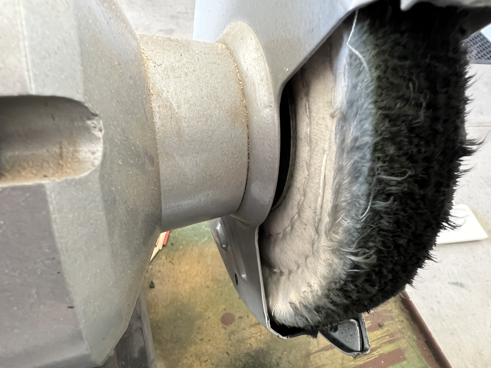
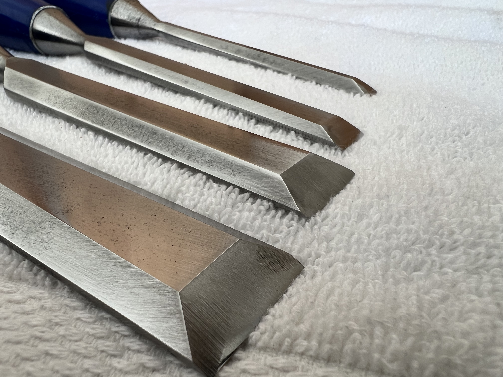
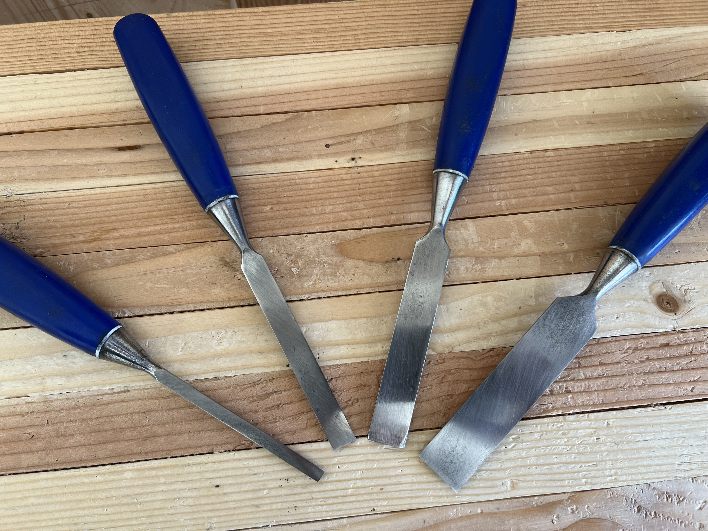
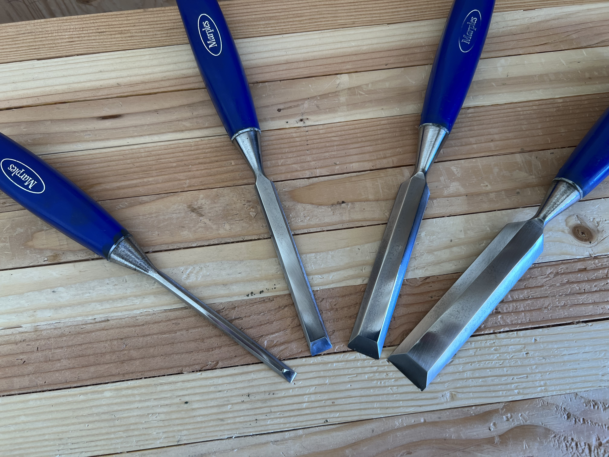
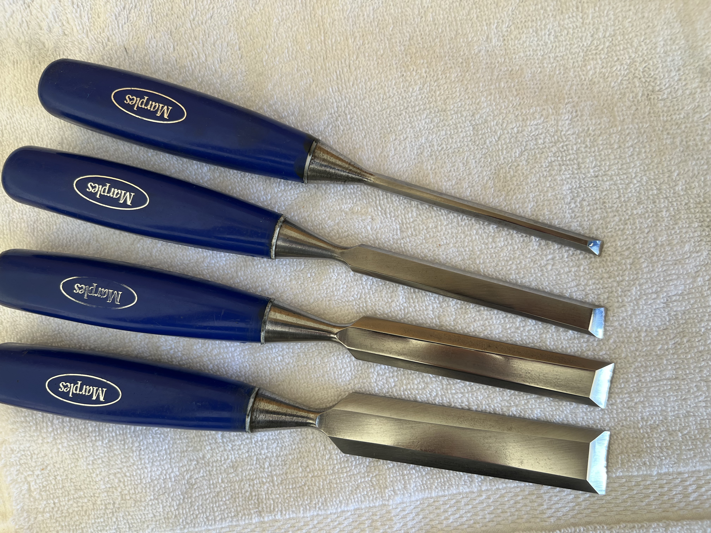

---

layout   : post
author   : bruce
toc      : false
comments : true
title    : "Saving Marples Conclusion"
beforetoc: "Saving a set of vintage chisels, bit of work for some great chisels."
categories: [ woodworking, tools, chisel ]
image     : assets/images/2023-10-1-savingMarplesConclusion/marples before and after.png
featured  : true
---
I applied the same steps to resorting the remaining Marples chisels that I did to the 3/4" chisel.

They turned out wonderfully well.  Additionally, before sharpening, I used the buffing wheel with the green compound to polish the non-cutting edges of the chisel.

{: width="360px"}

Here's the whole set.  Not bad for \$7.50 a chisel with shipping.  The 3/4" has already cut two deep through mortices and seems to hold it's edge well.  It still needs some more work as the last owner sharpened the tip with what seems like a camber and thinned out the very tip from the back as well.

{: width="360px"}

{: width="360px"}

{: width="360px"}

{: width="360px"}
